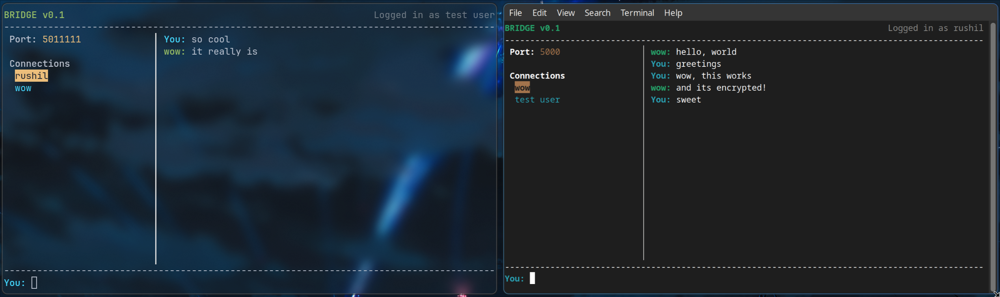

# BRIDGE

A P2P encrypted TUI LAN messenger written in C++. 
##### Made as a second semester project

## cool features

- Automatic peer discovery using UDP broadcast
- Peer-to-peer messaging over local network
- **Encrypted** (!!) communication between peers



## how it works

- Peers discover each other on the LAN using UDP broadcasts on a fixed port
- Once discovered, peers establish TCP connections
- All messages are encrypted using a shared key. The encryption is relatively basic (XOR using a deterministic key made from the users' names)

## build yourself
The project has been written for and tested ONLY on **linux**. Windows support is yet to be added (who am i kidding, it wont be added), but you can run it in WSL if you wish. To build, ensure `cmake` is installed, then:

```sh
make build
```

Compiles a binary at `./build/bridge`. run:

```sh
./build/bridge <YOUR_PORT_OF_CHOICE>
```

> NOTE: if two users on the network have the same port it skips the user when the UDP broadcast is recieved, those two users cannot see each other. Kinda counterintuitive but yeah make sure you pick a unique port

- Use the arrow keys to switch between peers.
- Type messages and press Enter to send.
- Messages from other peers do not appear until you have selected their contact to open the chat window.

## dependencies

- C++17 or later
- ncurses library
- cmake

## known issues
- UDP discovery should probably not mess up when two users have the same port (they have different IPs)
- Messages sometimes do not get decrypted, resulting in gibberish in the chat window. (fixes itself immediately after, but idk why it happens only sometimes)